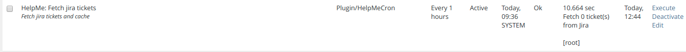

## Installation

First install and enable [HelpMe](https://github.com/studer-raimann/HelpMe).

### Install HelpMeCron-Plugin
Start at your ILIAS root directory
```bash
mkdir -p Customizing/global/plugins/Services/Cron/CronHook
cd Customizing/global/plugins/Services/Cron/CronHook
git clone https://github.com/studer-raimann/HelpMeCron.git HelpMeCron
```
Update and activate the plugin in the ILIAS Plugin Administration

### Some screenshots
Cron:


### Dependencies
* ILIAS 5.3 or ILIAS 5.4
* PHP >=7.0
* [composer](https://getcomposer.org)
* [HelpMe](https://github.com/studer-raimann/HelpMe)

Please use it for further development!

### Adjustment suggestions
* Adjustment suggestions by pull requests
* Adjustment suggestions which are not yet worked out in detail by Jira tasks under https://jira.studer-raimann.ch/projects/PLHM
* Bug reports under https://jira.studer-raimann.ch/projects/PLHM
* For external users you can report it at https://plugins.studer-raimann.ch/goto.php?target=uihk_srsu_PLHM

### ILIAS Plugin SLA
Wir lieben und leben die Philosophie von Open Source Software! Die meisten unserer Entwicklungen, welche wir im Kundenauftrag oder in Eigenleistung entwickeln, stellen wir öffentlich allen Interessierten kostenlos unter https://github.com/studer-raimann zur Verfügung.

Setzen Sie eines unserer Plugins professionell ein? Sichern Sie sich mittels SLA die termingerechte Verfügbarkeit dieses Plugins auch für die kommenden ILIAS Versionen. Informieren Sie sich hierzu unter https://studer-raimann.ch/produkte/ilias-plugins/plugin-sla.

Bitte beachten Sie, dass wir nur Institutionen, welche ein SLA abschliessen Unterstützung und Release-Pflege garantieren.
